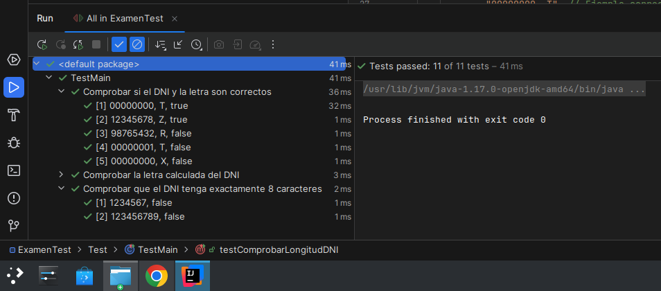
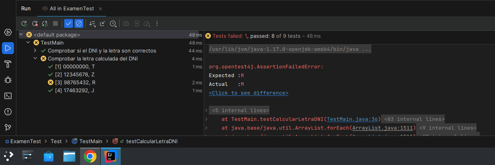
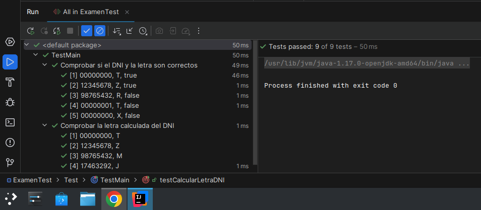
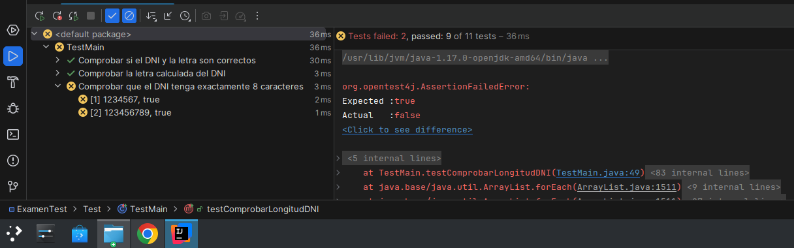

## Examen de Test Unitarios

---

### Enunciado

Con el código de este repositorio realiza:

- (*4 puntos*) Los test unitarios de los **dos** métodos, utiliza test **parametrizados**. Suponiendo que la `string` DNI, siempre es un DNI válido.
- (*2 puntos*) En el código, hay un error, ¿lo pudiste comprabar en los test? ¿Plantea la solución?
- (*3 puntos*) Si no hubiera una comprobación previamente encuanto a la longitud de la `string` del DNI, ¿Qué hay que cambiar en los tests para que comprueben estos casos?

Entrega tu repositorio con el código y los test. Además un `Readme` explicando y justificando cada apartado

Formato del `Readme` *1 punto*

---


# Repositorio para pruebas del cálculo de DNI

## Descripción

Este repositorio contiene el código de una aplicación que valida si un DNI español y su letra son correctos.
<br>
El código calcula la letra correspondiente a un número de DNI y la compara con la letra pasada como parámetro.

## Funcionalidades

- ```comprobarDNI```: Verifica si el DNI y la letra coinciden correctamente.
<br>
- ```calcularLetraDNI```:Calcula la letra correspondiente a un número de DNI.
<br>
- ```ComprobarLongitudDNI```:Comprueba que el DNI tenga 8 caracteres.
## Tests

Se han creado pruebas unitarias para los métodos de la clase `Main` usando JUnit. Los tests son parametrizados y cubren los siguientes casos:

## 1. **Prueba de comparación DNI-letra**: Verifica si el DNI y la letra proporcionada son correctos.



## 2. **Prueba de cálculo de letra**: Comprueba que la letra calculada coincida con la esperada.



### En este caso force un error y el propio IDE ya te dice el cambio que tienes que realizar para corregirlo.



## 3. **Prueba de longitud del DNI**: Verifica que el DNI tenga exactamente 8 caracteres. En un principio este error estaba en el código original.



## Errores y Solución:

### Error en el código

Se ha identificado un posible error en `calcularLetraDNI`: No se valida que la entrada sea de 8 caracteres numéricos.
<br>
Antes de convertir el `String` a `int`, se debe verificar su longitud y formato para evitar `NumberFormatException`.

## Solución

Se ha añadido una validación en la función `calcularLetraDNI` para comprobar que el DNI tenga 8 dígitos numéricos.
<br>
Si el DNI no cumple con este formato, se lanza una excepción `NumberFormatException`.

```java
/*
if (dni == null || !dni.matches("\\d{8}")) {
    throw new NumberFormatException("Formato de DNI inválido");
}
 */
```

## Cambios en los tests (TestMain.java)

Ahora que `comprobarDNI` retorna `false` para DNIs con longitud incorrecta, hay que modificar los tests para reflejar esto.

### Modificar `testComprobarDNI` para incluir casos de longitud incorrecta

Agregar casos de prueba para DNIs con menos o más de 8 caracteres:

```java
/*
@CsvSource({
        
        "00000000, T, true",
        "12345678, Z, true",
        "98765432, R, false",
        "00000001, T, false",
        "00000000, X, false",
        "1234567, X, false",   // DNI con 7 caracteres (incorrecto)
        "123456789, X, false", // DNI con 9 caracteres (incorrecto)
        "ABCDEFGH, X, false"   // DNI con caracteres no numéricos (incorrecto)
        
})
*/
```

### Eliminar `testComprobarLongitudDNI`

Ya no es necesario un test separado para la longitud, porque ahora la función `comprobarDNI` ya esta corregida.

### Resumen de los cambios

-   Modificar `comprobarDNI` para rechazar DNIs con longitud incorrecta.
-   Actualizar `testComprobarDNI` para incluir DNIs con longitudes incorrectas y caracteres no numéricos.
-   Eliminar `testComprobarLongitudDNI`, ya que la validación ahora está integrada en `comprobarDNI`.